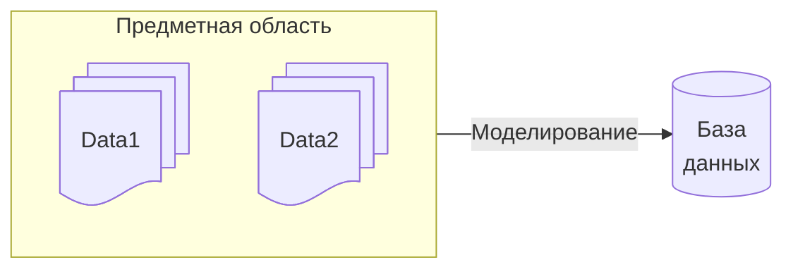

# Основные понятия ПБД

**Информация** - совокупность фактов, наблюдений, сведений о реальном мире, его объектах и явлениях.

**Данные** - это информация, представленная в определенном виде, позволяющем автоматизировать ее сбор, хранение и дальнейшую обработку человеком или информационным средством

**Данные** - набор конкретных значений и параметров, характеризующих объект, условия, ситуацию или любые другие факторы.

Данные это **_форма представления_** информации, а информация это данные, **_интерпретированные (понятые)_** пользователем

**База данных (БД)** - совокупность взаимосвязанных, хранящихся вместе данных, отражающая состояние объектов и их отношения в рассматриваемой предметной области.

**Предметная область (ПрО)** - некоторая область человеческой деятельности или реального мира, подлежащая изученю для организации управления и автоматизации.

**Система управления базами данных (СУБД)** — совокупность языковых и программных средств, предназначенных для создания, ведения и совместного использования БД многими пользователями.

**Моделирование (проектирование)** - процесс описания предметной области, т.е. создания моделей разной степени детализации

**Абстрагирование** - процесс выделения основной информации, подлежащей хранению и исключение несущественной информации

**Модель данных** - некоторая абстракция, которая позволяет трактовать данные как информацию. 

_С помощью модели данных могут быть представлены объекты предметной области_

Требования к БД:
- защищенность и безопасность
- эффективность доступа для каждого пользователя
- минимальная избыточность (данныек не дублируются, и удаление любого элемента данных ведет к потере информации о предметной области)
- непротиворечивость (данные отвечают определенным _ограничениям целостности_)

**Целостность** - свойство данных, характеризующееся отсутствием противоречий, достоверностью и понятностью

- независимость от приложений
    - логическая - возможность изменения логического уровня представления данных одного приложения без изменения другого
    - физическая - возможность изменения физического уровня представления данных без изменения концептуальной схемы

