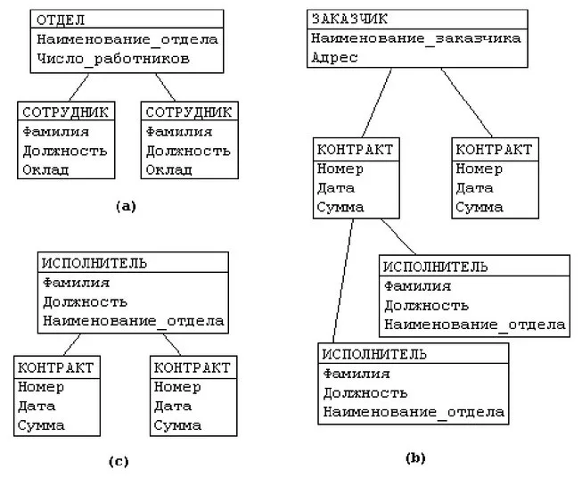

# Модели данных

Модель – способ структурирования данных, описания взаимосвязей между данными

## Иерархическая модель

Представляет данные в виде иерархии. Модель ориентирована на описание объектов, находящихся между собой в отношении подчинения. Например, структура кадров некоторой организации. Организация состоит из отделов, каждый отдел имеет руководителя и сотрудников. Другой пример: объект «колесо» является составной частью объекта «автомобиль». Между автомобилем и колесом имеется связь, смысл которой можно озвучить следующим образом: объект «автомобиль» включает в себя несколькообъектов «колесо».

## Сетевая модель

Сетевая модель представляет собой развитие иерархической. Модель позволяет описывать более сложные виды взаимоотношений между данными. Однако расширение возможностей достигается за счет большей сложности реализации самой модели и трудности манипулирования данными.

## Реляционная модель

В реляционной модели данные представляются в виде таблиц, состоящих из строк и столбцов. Каждая строка таблицы – информация об одном конкретном объекте, столбцы содержат свойства этого объекта. Взаимоотношения между объектами задаются с помощью связей между столбцами таблиц. Реляционная модель на сегодняшний день наиболее распространена. Она достаточно универсальна и проста в проектировании. 

## Объектная модель

В этой модели данные представляются в форме объектов. Объект имеет набор свойств, называемых атрибутами, и может включать в себя также процедуры для обработки данных, которые называют методами. Объекты, имеющие одинаковые наборы атрибутов и различающиеся только их значениями, образуют некоторый класс объектов. Например, класс «клиент» может иметь следующие атрибуты: «фамилия», «имя», «отчество», «номер кредитной карты». Для каждого объекта из этого класса определены конкретные значения перечисленных атрибутов. Говорят, что объект является экземпляром класса. На основе существующего класса могут создаваться новые, наследующие свойства исходного. При этом исходный класс именуется родителем нового класса. Производный класс называют потомком исходного. При этом объекты – экземпляры класса-потомка принадлежат также и родительскому классу, поскольку обладают всеми его атрибутами. Пример: на основе класса «клиент» может быть определен класс «постоянный клиент». Новый класс наследует атрибуты родительского и при этом добавляется новый атрибут – «процент скидки». Все постоянные клиенты продолжают оставаться клиентами в прежнем понимании, но о них имеется еще и дополнительная информация. В настоящее время не существует единого подхода к реализации объектных баз данных. 

Объектный подход – набор общих принципов, которые могут применяться при проектировании различных приложений.

## Гибридные модели

В некоторых приложениях предпринимаются попытки смешения различных моделей представления данных. Пример такого смешения – объектно-реляционная модель. В ней использовано некоторое сходство между реляционной и объектной идеологией. Строки таблиц реляционной модели соответствуют объектам объектной модели, столбцы таблиц – атрибутам объектов. Таблицы в целом являются аналогом классов. Отсюда вытекает возможность введения наследования при определении таблиц – таблица-потомок содержит те же столбцы, что и родительская, и, кроме того – дополнительные, определенные при наследовании. По идее создателей, объектно-реляционная модель должна унаследовать от реляционной легкость описания и манипулирования данными, а от объектной – возможность определения более сложных взаимоотношений между объектами.
